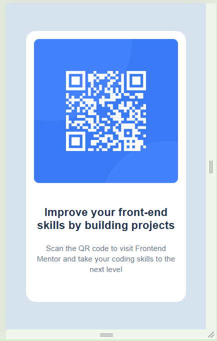
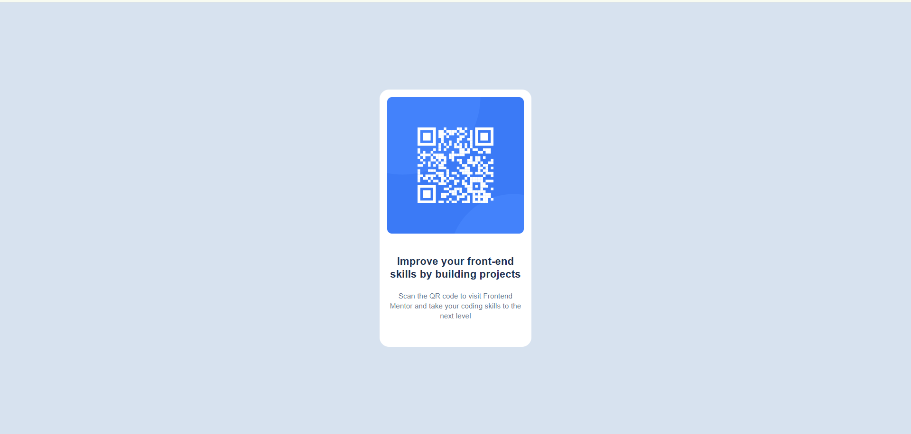

## Overview

### Screenshot

### Links

- Solution URL: (https://github.com/Postoiu/qr-code-component-main)
- Live Site URL: (https://postoiu.github.io/qr-code-component-main/)

## My process
- Created the HTML structure
- The CSS was made by trial an error, I didn't really knew what I was doing there

### Built with

- Semantic HTML5 markup
- CSS custom properties
- Flexbox

### Continued development

I need to learn more about techniques used in frontend development in order to create page layouts and other components

## Author

- Frontend Mentor - [@Postoiu](https://www.frontendmentor.io/profile/Postoiu)

